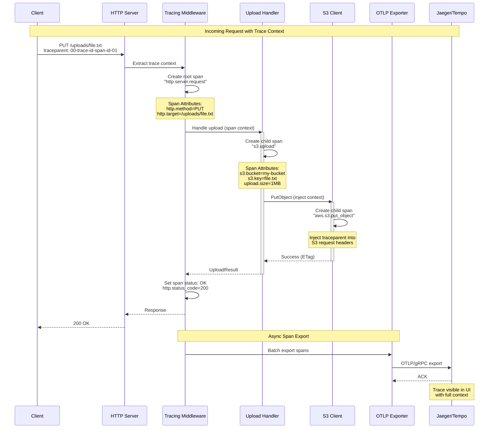
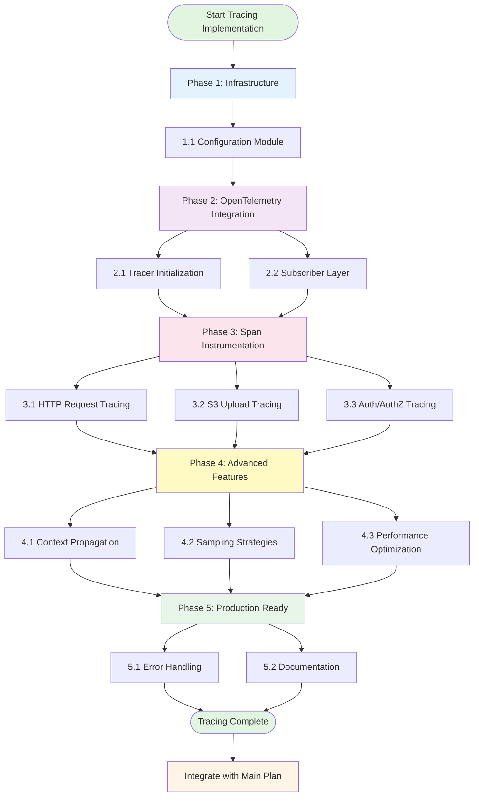
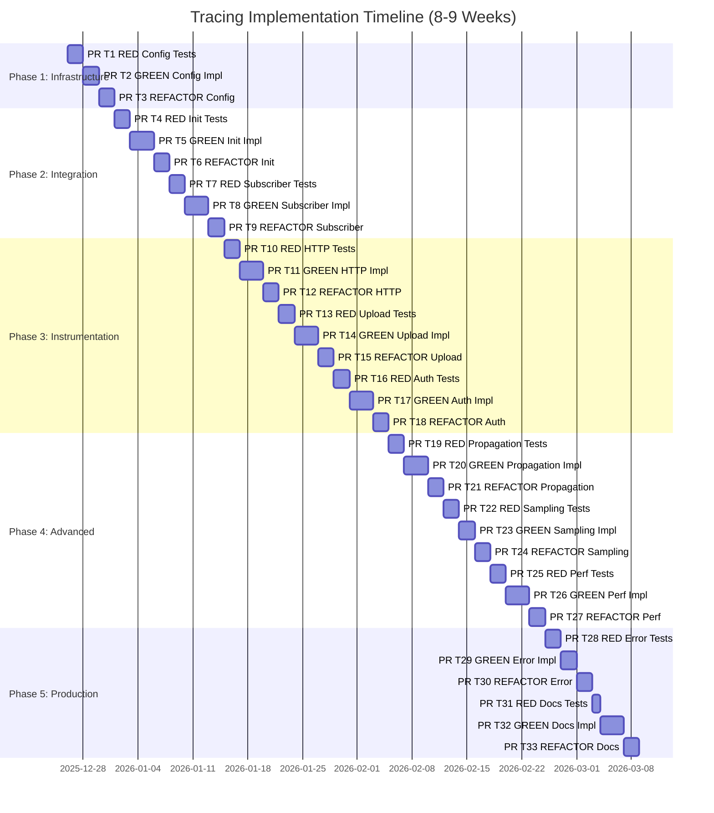
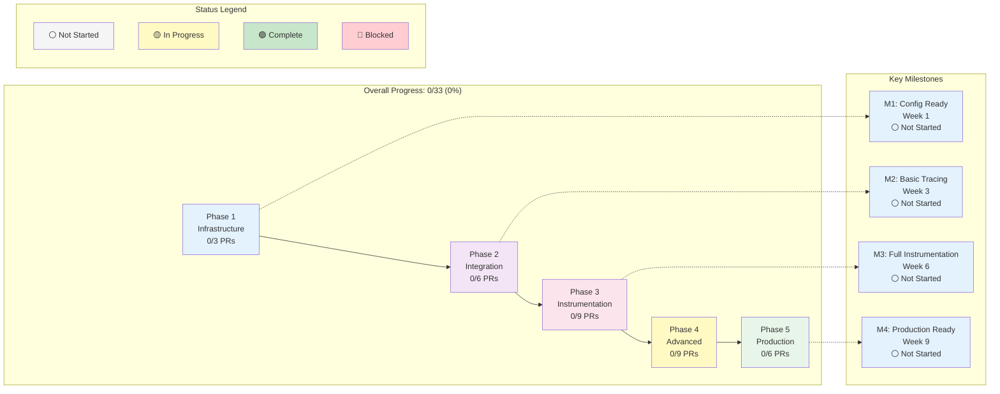

# Mizuchi Uploadr - OpenTelemetry Tracing Implementation Plan

> **Methodology**: Strict TDD (Test-Driven Development) - Red-Green-Refactor Cycle
> **Feature**: OpenTelemetry distributed tracing with OTLP export
> **PR Strategy**: One PR per TDD phase (RED, GREEN, REFACTOR)

## Current Status

### ✅ Already Available

- `tracing` crate (0.1) - Basic tracing macros
- `tracing-subscriber` (0.3) - Subscriber with env-filter and JSON support
- `opentelemetry` (0.21) - Optional dependency
- `opentelemetry-otlp` (0.14) - Optional OTLP exporter
- Feature flag: `tracing = ["opentelemetry", "opentelemetry-otlp"]`
- Basic structured logging in `main.rs` using `FmtSubscriber`
- Tracing calls in some modules (e.g., `put_object.rs`, `server/mod.rs`)

### 🚧 Needs Implementation

- OpenTelemetry integration layer
- OTLP exporter configuration
- Trace context propagation
- Span instrumentation for key operations
- Configuration for tracing backends
- Trace sampling strategies
- Integration with Pingora server

### ❌ Not Started

- Distributed trace context propagation (W3C Trace Context)
- Custom span attributes for S3 operations
- Trace correlation with metrics
- Performance impact measurement
- Production-ready tracing configuration

---

## Architecture Overview

```
┌─────────────────────────────────────────────────────────────┐
│                    Tracing Architecture                      │
├─────────────────────────────────────────────────────────────┤
│                                                              │
│  Application Code                                            │
│  ├── #[instrument] macros                                    │
│  ├── tracing::info!/debug!/error!                           │
│  └── Span::current()                                         │
│                    │                                          │
│                    ▼                                          │
│  Tracing Subscriber Layer                                    │
│  ├── OpenTelemetry Layer (spans → traces)                   │
│  ├── Fmt Layer (console output)                             │
│  └── EnvFilter (log level filtering)                        │
│                    │                                          │
│                    ▼                                          │
│  OpenTelemetry SDK                                           │
│  ├── Trace Provider                                          │
│  ├── Span Processor (batch/simple)                          │
│  └── Sampler (always/ratio/parent-based)                    │
│                    │                                          │
│                    ▼                                          │
│  OTLP Exporter                                               │
│  ├── gRPC/HTTP transport                                     │
│  ├── Compression (gzip)                                      │
│  └── Retry logic                                             │
│                    │                                          │
│                    ▼                                          │
│  Tracing Backend                                             │
│  ├── Jaeger                                                  │
│  ├── Tempo                                                   │
│  ├── Honeycomb                                               │
│  └── Any OTLP-compatible backend                            │
│                                                              │
└─────────────────────────────────────────────────────────────┘
```

---

## Visual Architecture Diagrams

### Tracing Flow Sequence



### Implementation Phases Flow



---

## Phase 1: Tracing Infrastructure (Foundation)

### 1.1 Configuration Module

**Goal**: Add tracing configuration to YAML config

**TDD Workflow**:

1. 🔴 **RED**: Write failing tests for tracing config

   - Test: Parse tracing config from YAML
   - Test: Default values when tracing disabled
   - Test: Validate OTLP endpoint URL
   - **PR #T1**: RED phase - failing tests

2. 🟢 **GREEN**: Implement tracing configuration

   - Add `TracingConfig` struct to `src/config/mod.rs`
   - Add OTLP endpoint, service name, sampling rate
   - Add environment variable expansion
   - **PR #T2**: GREEN phase - passing tests

3. 🔵 **REFACTOR**: Clean up config structure
   - Extract common patterns
   - Add validation helpers
   - Improve documentation
   - **PR #T3**: REFACTOR phase - improved code

**Files to Create/Modify**:

- `src/config/mod.rs` (modify - add `TracingConfig`)
- `config.example.yaml` (modify - add tracing section)
- `tests/config_test.rs` (new - tracing config tests)

**Configuration Schema**:

```yaml
tracing:
  enabled: true
  service_name: "mizuchi-uploadr"
  otlp:
    endpoint: "http://localhost:4317" # gRPC endpoint
    protocol: "grpc" # or "http"
    timeout_seconds: 10
    compression: "gzip"
  sampling:
    strategy: "parent_based" # always, never, ratio, parent_based
    ratio: 1.0 # 0.0 to 1.0
  batch:
    max_queue_size: 2048
    scheduled_delay_millis: 5000
    max_export_batch_size: 512
```

**Acceptance Criteria**:

- [ ] Tracing config parsed from YAML
- [ ] Environment variables expanded (e.g., `${OTLP_ENDPOINT}`)
- [ ] Validation errors for invalid config
- [ ] All tests pass: `cargo test --lib config::tracing`

---

## Phase 2: OpenTelemetry Integration

### 2.1 Tracing Initialization Module

**Goal**: Initialize OpenTelemetry tracer provider with OTLP exporter

**TDD Workflow**:

1. 🔴 **RED**: Write failing tests for tracer initialization

   - Test: Initialize tracer with config
   - Test: OTLP exporter created correctly
   - Test: Graceful shutdown on drop
   - **PR #T4**: RED phase

2. 🟢 **GREEN**: Implement tracer initialization

   - Create `src/tracing/mod.rs`
   - Implement `init_tracing()` function
   - Set up OTLP exporter with gRPC
   - Configure batch span processor
   - **PR #T5**: GREEN phase

3. 🔵 **REFACTOR**: Optimize initialization
   - Add retry logic for OTLP connection
   - Improve error handling
   - Add graceful shutdown
   - **PR #T6**: REFACTOR phase

**Files to Create/Modify**:

- `src/tracing/mod.rs` (new)
- `src/tracing/init.rs` (new)
- `src/lib.rs` (modify - add tracing module)
- `tests/tracing_init_test.rs` (new)

**Acceptance Criteria**:

- [ ] Tracer provider initialized successfully
- [ ] OTLP exporter connects to backend
- [ ] Spans exported in batches
- [ ] Graceful shutdown flushes pending spans
- [ ] All tests pass: `cargo test --lib tracing::init`

---

### 2.2 Subscriber Layer Integration

**Goal**: Integrate OpenTelemetry layer with tracing-subscriber

**TDD Workflow**:

1. 🔴 **RED**: Write tests for subscriber setup

   - Test: Multiple layers work together
   - Test: Console output still works
   - Test: Spans sent to OTLP
   - **PR #T7**: RED phase

2. 🟢 **GREEN**: Implement layered subscriber

   - Use `tracing-opentelemetry` crate
   - Combine OpenTelemetry + Fmt layers
   - Add EnvFilter for log levels
   - **PR #T8**: GREEN phase

3. 🔵 **REFACTOR**: Optimize subscriber configuration
   - Make layers conditional based on config
   - Add JSON formatting option
   - **PR #T9**: REFACTOR phase

**Files to Create/Modify**:

- `src/tracing/subscriber.rs` (new)
- `src/main.rs` (modify - use new subscriber)
- `Cargo.toml` (add `tracing-opentelemetry`)

**Dependencies to Add**:

```toml
tracing-opentelemetry = "0.22"
```

**Acceptance Criteria**:

- [ ] OpenTelemetry layer captures spans
- [ ] Console output still visible
- [ ] Log levels filtered correctly
- [ ] All tests pass: `cargo test --lib tracing::subscriber`

---

## Phase 3: Span Instrumentation

### 3.1 HTTP Request Tracing

**Goal**: Instrument HTTP requests with distributed tracing

**TDD Workflow**:

1. 🔴 **RED**: Write tests for HTTP span creation

   - Test: Root span created for each request
   - Test: HTTP attributes added (method, path, status)
   - Test: Trace context extracted from headers
   - **PR #T10**: RED phase

2. 🟢 **GREEN**: Implement HTTP instrumentation

   - Add middleware for span creation
   - Extract W3C Trace Context headers
   - Add HTTP semantic conventions
   - **PR #T11**: GREEN phase

3. 🔵 **REFACTOR**: Optimize HTTP tracing
   - Reduce span overhead
   - Add custom attributes
   - **PR #T12**: REFACTOR phase

**Files to Create/Modify**:

- `src/server/tracing_middleware.rs` (new)
- `src/server/mod.rs` (modify)
- `tests/http_tracing_test.rs` (new)

**Span Attributes** (OpenTelemetry Semantic Conventions):

```rust
span.set_attribute("http.method", "PUT");
span.set_attribute("http.target", "/uploads/file.txt");
span.set_attribute("http.status_code", 200);
span.set_attribute("http.request_content_length", 1024);
span.set_attribute("net.peer.ip", "192.168.1.1");
```

**Acceptance Criteria**:

- [ ] Span created for each HTTP request
- [ ] Trace context propagated via headers
- [ ] HTTP attributes follow semantic conventions
- [ ] All tests pass: `cargo test --lib server::tracing`

---

### 3.2 S3 Upload Operation Tracing

**Goal**: Instrument S3 upload operations with detailed spans

**TDD Workflow**:

1. 🔴 **RED**: Write tests for upload span creation

   - Test: PutObject creates child span
   - Test: Multipart upload creates nested spans
   - Test: Zero-copy transfer tracked
   - **PR #T13**: RED phase

2. 🟢 **GREEN**: Implement upload instrumentation

   - Add `#[instrument]` to upload handlers
   - Create spans for S3 API calls
   - Track bytes transferred
   - **PR #T14**: GREEN phase

3. 🔵 **REFACTOR**: Add custom attributes
   - S3 bucket, key, size
   - Upload method (simple/multipart)
   - Zero-copy enabled/disabled
   - **PR #T15**: REFACTOR phase

**Files to Create/Modify**:

- `src/upload/put_object.rs` (modify)
- `src/upload/multipart.rs` (modify)
- `src/upload/zero_copy.rs` (modify)
- `tests/upload_tracing_test.rs` (new)

**Custom Span Attributes**:

```rust
span.set_attribute("s3.bucket", "my-bucket");
span.set_attribute("s3.key", "path/to/file.txt");
span.set_attribute("s3.operation", "PutObject");
span.set_attribute("upload.size_bytes", 10485760);
span.set_attribute("upload.method", "multipart");
span.set_attribute("upload.parts", 10);
span.set_attribute("upload.zero_copy", true);
```

**Acceptance Criteria**:

- [ ] Upload operations create child spans
- [ ] S3 attributes added to spans
- [ ] Multipart uploads show part-level spans
- [ ] All tests pass: `cargo test --lib upload::tracing`

---

### 3.3 Authentication & Authorization Tracing

**Goal**: Trace auth/authz operations for security auditing

**TDD Workflow**:

1. 🔴 **RED**: Write tests for auth tracing

   - Test: JWT validation creates span
   - Test: SigV4 validation creates span
   - Test: OPA/OpenFGA calls traced
   - **PR #T16**: RED phase

2. 🟢 **GREEN**: Implement auth instrumentation

   - Add spans to JWT validator
   - Add spans to SigV4 validator
   - Add spans to authz clients
   - **PR #T17**: GREEN phase

3. 🔵 **REFACTOR**: Add security attributes
   - User ID (without PII)
   - Auth method used
   - Authorization decision
   - **PR #T18**: REFACTOR phase

**Files to Create/Modify**:

- `src/auth/jwt.rs` (modify)
- `src/auth/sigv4.rs` (modify)
- `src/authz/opa/mod.rs` (modify)
- `src/authz/openfga/mod.rs` (modify)

**Acceptance Criteria**:

- [ ] Auth operations traced
- [ ] No PII in span attributes
- [ ] Authorization decisions logged
- [ ] All tests pass: `cargo test --lib auth::tracing authz::tracing`

---

## Phase 4: Advanced Features

### 4.1 Trace Context Propagation

**Goal**: Propagate trace context across service boundaries

**TDD Workflow**:

1. 🔴 **RED**: Write tests for context propagation

   - Test: W3C Trace Context headers extracted
   - Test: Trace context injected into S3 requests
   - Test: Parent-child span relationships
   - **PR #T19**: RED phase

2. 🟢 **GREEN**: Implement context propagation

   - Extract `traceparent` and `tracestate` headers
   - Inject context into outgoing requests
   - Link spans correctly
   - **PR #T20**: GREEN phase

3. 🔵 **REFACTOR**: Optimize propagation
   - Cache context extractors
   - Reduce allocations
   - **PR #T21**: REFACTOR phase

**Files to Create/Modify**:

- `src/tracing/propagation.rs` (new)
- `src/s3/client.rs` (modify)
- `tests/propagation_test.rs` (new)

**W3C Trace Context Headers**:

```
traceparent: 00-0af7651916cd43dd8448eb211c80319c-b7ad6b7169203331-01
tracestate: congo=t61rcWkgMzE
```

**Acceptance Criteria**:

- [ ] Trace context extracted from incoming requests
- [ ] Context propagated to S3 API calls
- [ ] Distributed traces work end-to-end
- [ ] All tests pass: `cargo test --lib tracing::propagation`

---

### 4.2 Sampling Strategies

**Goal**: Implement intelligent trace sampling

**TDD Workflow**:

1. 🔴 **RED**: Write tests for sampling

   - Test: Always sampler samples all traces
   - Test: Ratio sampler samples percentage
   - Test: Parent-based sampler respects parent
   - **PR #T22**: RED phase

2. 🟢 **GREEN**: Implement sampling strategies

   - Configure sampler from config
   - Support multiple strategies
   - **PR #T23**: GREEN phase

3. 🔵 **REFACTOR**: Add custom samplers
   - Error-based sampling (always sample errors)
   - Slow request sampling
   - **PR #T24**: REFACTOR phase

**Files to Create/Modify**:

- `src/tracing/sampling.rs` (new)
- `src/tracing/init.rs` (modify)

**Acceptance Criteria**:

- [ ] Sampling strategies configurable
- [ ] Ratio sampling works correctly
- [ ] Parent-based sampling respects upstream
- [ ] All tests pass: `cargo test --lib tracing::sampling`

---

### 4.3 Performance Optimization

**Goal**: Minimize tracing overhead

**TDD Workflow**:

1. 🔴 **RED**: Write benchmark tests

   - Benchmark: Request with tracing vs without
   - Benchmark: Span creation overhead
   - Benchmark: OTLP export latency
   - **PR #T25**: RED phase

2. 🟢 **GREEN**: Optimize hot paths

   - Use batch span processor
   - Reduce attribute allocations
   - Optimize span creation
   - **PR #T26**: GREEN phase

3. 🔵 **REFACTOR**: Final optimizations
   - Tune batch processor settings
   - Add span caching
   - **PR #T27**: REFACTOR phase

**Files to Create/Modify**:

- `benches/tracing_benchmark.rs` (new)
- `src/tracing/init.rs` (modify)

**Acceptance Criteria**:

- [ ] Tracing overhead <5% of request latency
- [ ] Batch export reduces network calls
- [ ] No memory leaks in long-running tests
- [ ] All benchmarks pass: `cargo bench tracing`

---

## Phase 5: Production Readiness

### 5.1 Error Handling & Resilience

**Goal**: Handle tracing backend failures gracefully

**TDD Workflow**:

1. 🔴 **RED**: Write tests for failure scenarios

   - Test: OTLP backend unavailable
   - Test: Network timeout
   - Test: Invalid configuration
   - **PR #T28**: RED phase

2. 🟢 **GREEN**: Implement error handling

   - Retry logic for OTLP export
   - Fallback to console logging
   - Circuit breaker for backend
   - **PR #T29**: GREEN phase

3. 🔵 **REFACTOR**: Improve resilience
   - Add exponential backoff
   - Log export failures
   - **PR #T30**: REFACTOR phase

**Files to Create/Modify**:

- `src/tracing/error.rs` (new)
- `src/tracing/init.rs` (modify)

**Acceptance Criteria**:

- [ ] Application continues if tracing fails
- [ ] Export failures logged but don't crash
- [ ] Retry logic prevents thundering herd
- [ ] All tests pass: `cargo test --lib tracing::error`

---

### 5.2 Documentation & Examples

**Goal**: Comprehensive tracing documentation

**TDD Workflow**:

1. 🔴 **RED**: Write documentation tests

   - Test: Example configurations compile
   - Test: Code examples in docs work
   - **PR #T31**: RED phase

2. 🟢 **GREEN**: Write documentation

   - Add module-level docs
   - Create examples directory
   - Document configuration options
   - **PR #T32**: GREEN phase

3. 🔵 **REFACTOR**: Improve docs
   - Add diagrams
   - Add troubleshooting guide
   - **PR #T33**: REFACTOR phase

**Files to Create/Modify**:

- `docs/TRACING.md` (new)
- `examples/tracing_jaeger.rs` (new)
- `examples/tracing_tempo.rs` (new)
- `src/tracing/mod.rs` (add docs)

**Acceptance Criteria**:

- [ ] All public APIs documented
- [ ] Examples run successfully
- [ ] Troubleshooting guide complete
- [ ] All doc tests pass: `cargo test --doc`

---

## Testing Strategy

### Unit Tests

- **Location**: Inline in `src/tracing/**/*.rs`
- **Command**: `cargo test --lib --features tracing`
- **Coverage**: Each tracing component

### Integration Tests

- **Location**: `tests/tracing_integration_test.rs`
- **Command**: `cargo test --test tracing_integration --features tracing`
- **Coverage**: End-to-end tracing flows

### Benchmarks

- **Location**: `benches/tracing_benchmark.rs`
- **Command**: `cargo bench --features tracing`
- **Coverage**: Performance overhead measurement

### E2E Tests

- **Location**: `tests/e2e_tracing.rs`
- **Command**: Requires Jaeger/Tempo running
- **Coverage**: Full distributed tracing validation

---

## Quality Gates (Before Each PR Merge)

Every PR MUST pass these checks:

1. ✅ **All Tests Pass**: `cargo test --all-features`
2. ✅ **No Clippy Warnings**: `cargo clippy --features tracing -- -D warnings`
3. ✅ **Code Formatted**: `cargo fmt --check`
4. ✅ **Documentation**: `cargo doc --no-deps --features tracing`
5. ✅ **Feature Flag Works**: Test with and without `tracing` feature

---

## Dependencies to Add

```toml
[dependencies]
# Add to existing dependencies
tracing-opentelemetry = "0.22"
opentelemetry-semantic-conventions = "0.13"

# Update optional dependencies (already present)
opentelemetry = { version = "0.21", optional = true }
opentelemetry-otlp = { version = "0.14", optional = true }
```

---

## Configuration Example

**config.yaml**:

```yaml
server:
  address: "0.0.0.0:8080"
  # ... existing config ...

tracing:
  enabled: true
  service_name: "mizuchi-uploadr"
  environment: "production"

  otlp:
    endpoint: "${OTLP_ENDPOINT:-http://localhost:4317}"
    protocol: "grpc"
    timeout_seconds: 10
    compression: "gzip"
    headers:
      x-api-key: "${OTLP_API_KEY}"

  sampling:
    strategy: "parent_based"
    ratio: 0.1 # Sample 10% of traces

  batch:
    max_queue_size: 2048
    scheduled_delay_millis: 5000
    max_export_batch_size: 512

  # Optional: Resource attributes
  resource:
    service.version: "0.1.0"
    deployment.environment: "production"
    host.name: "${HOSTNAME}"

metrics:
  enabled: true
  port: 9090
```

---

## Estimated Timeline

| Phase                              | PRs         | Estimated Time |
| ---------------------------------- | ----------- | -------------- |
| Phase 1: Infrastructure            | PR #T1-T3   | 1 week         |
| Phase 2: OpenTelemetry Integration | PR #T4-T9   | 2 weeks        |
| Phase 3: Span Instrumentation      | PR #T10-T18 | 2-3 weeks      |
| Phase 4: Advanced Features         | PR #T19-T27 | 2 weeks        |
| Phase 5: Production Readiness      | PR #T28-T33 | 1 week         |
| **Total**                          | **33 PRs**  | **8-9 weeks**  |

### Timeline Gantt Chart



### Progress Status Dashboard



---

## Success Criteria

The tracing implementation is complete when:

1. ✅ All 33 PRs merged
2. ✅ All tests passing (unit, integration, E2E)
3. ✅ Tracing overhead <5% of request latency
4. ✅ Distributed traces visible in Jaeger/Tempo
5. ✅ W3C Trace Context propagation works
6. ✅ Sampling strategies configurable
7. ✅ Documentation complete with examples
8. ✅ Feature flag allows disabling tracing
9. ✅ Graceful degradation if backend unavailable
10. ✅ Production deployment successful

---

## Integration with Main Implementation Plan

This tracing plan can be executed:

1. **In Parallel**: After Phase 1 (Core Infrastructure) of main plan
2. **Integrated**: Tracing added to each phase as features are built
3. **Standalone**: As a separate feature branch merged later

**Recommended Approach**: Integrate tracing incrementally during Phase 2-3 of main implementation plan.

---

## Tracing Backends Supported

- **Jaeger**: Open-source distributed tracing
- **Grafana Tempo**: Scalable distributed tracing backend
- **Honeycomb**: Observability platform
- **AWS X-Ray**: Via OTLP collector
- **Google Cloud Trace**: Via OTLP collector
- **Any OTLP-compatible backend**

---

## Next Steps

1. **Review this plan** with the team
2. **Set up local Jaeger** for development: `docker run -d -p 4317:4317 -p 16686:16686 jaegertracing/all-in-one:latest`
3. **Start Phase 1.1** - Tracing Configuration
4. **Follow TDD strictly** - Red, Green, Refactor for each feature
5. **Test with real backends** - Validate OTLP export works

---

_Last Updated: 2025-12-25_
_Methodology: TDD Red-Green-Refactor with PR-per-Phase_
_Feature: OpenTelemetry Distributed Tracing_
