# Mizuchi Uploadr - OpenTelemetry Tracing Implementation Plan

> **Methodology**: Strict TDD (Test-Driven Development) - Red-Green-Refactor Cycle
> **Feature**: OpenTelemetry distributed tracing with OTLP export
> **PR Strategy**: One PR per phase/feature (complete TDD cycle in single PR)

## Implementation Summary

### PR Strategy (Updated)

**One PR per Phase/Feature** - Each PR contains complete Red-Green-Refactor cycle:

- ✅ **Phase 1** (PR #4): Configuration Infrastructure - COMPLETE
- 🚧 **Phase 2** (PR #5): OpenTelemetry Integration - IN PROGRESS
- ⏳ **Phase 3** (PR #6): Span Instrumentation - NOT STARTED
- ⏳ **Phase 4** (PR #7): Advanced Features - NOT STARTED
- ⏳ **Phase 5** (PR #8): Production Readiness - NOT STARTED

### Progress Tracking

| Phase                | Status         | PR  | Tests       | Files     |
| -------------------- | -------------- | --- | ----------- | --------- |
| 1. Configuration     | ✅ Complete    | #4  | 8/8 passing | 3 files   |
| 2. OTel Integration  | 🚧 In Progress | #5  | 0/10        | 0/6 files |
| 3. Instrumentation   | ⏳ Not Started | #6  | 0/15        | 0/7 files |
| 4. Advanced Features | ⏳ Not Started | #7  | 0/12        | 0/9 files |
| 5. Production Ready  | ⏳ Not Started | #8  | 0/8         | 0/7 files |

---

## Current Status

### ✅ Already Available

- `tracing` crate (0.1) - Basic tracing macros
- `tracing-subscriber` (0.3) - Subscriber with env-filter and JSON support
- `opentelemetry` (0.21) - Optional dependency
- `opentelemetry-otlp` (0.14) - Optional OTLP exporter
- Feature flag: `tracing = ["opentelemetry", "opentelemetry-otlp"]`
- Basic structured logging in `main.rs` using `FmtSubscriber`
- Tracing calls in some modules (e.g., `put_object.rs`, `server/mod.rs`)

### 🚧 Needs Implementation

- OpenTelemetry integration layer
- OTLP exporter configuration
- Trace context propagation
- Span instrumentation for key operations
- Configuration for tracing backends
- Trace sampling strategies
- Integration with Pingora server

### ❌ Not Started

- Distributed trace context propagation (W3C Trace Context)
- Custom span attributes for S3 operations
- Trace correlation with metrics
- Performance impact measurement
- Production-ready tracing configuration

---

## Architecture Overview

```
┌─────────────────────────────────────────────────────────────┐
│                    Tracing Architecture                      │
├─────────────────────────────────────────────────────────────┤
│                                                              │
│  Application Code                                            │
│  ├── #[instrument] macros                                    │
│  ├── tracing::info!/debug!/error!                           │
│  └── Span::current()                                         │
│                    │                                          │
│                    ▼                                          │
│  Tracing Subscriber Layer                                    │
│  ├── OpenTelemetry Layer (spans → traces)                   │
│  ├── Fmt Layer (console output)                             │
│  └── EnvFilter (log level filtering)                        │
│                    │                                          │
│                    ▼                                          │
│  OpenTelemetry SDK                                           │
│  ├── Trace Provider                                          │
│  ├── Span Processor (batch/simple)                          │
│  └── Sampler (always/ratio/parent-based)                    │
│                    │                                          │
│                    ▼                                          │
│  OTLP Exporter                                               │
│  ├── gRPC/HTTP transport                                     │
│  ├── Compression (gzip)                                      │
│  └── Retry logic                                             │
│                    │                                          │
│                    ▼                                          │
│  Tracing Backend                                             │
│  ├── Jaeger                                                  │
│  ├── Tempo                                                   │
│  ├── Honeycomb                                               │
│  └── Any OTLP-compatible backend                            │
│                                                              │
└─────────────────────────────────────────────────────────────┘
```

---

## Visual Architecture Diagrams

### Tracing Flow Sequence


### Implementation Phases Flow


---

## Phase 1: Tracing Infrastructure (Foundation) ✅ COMPLETE

### 1.1 Configuration Module ✅ COMPLETE

**Goal**: Add tracing configuration to YAML config

**Status**: ✅ Merged in PR #4

**TDD Workflow** (Complete Red-Green-Refactor cycle):

1. 🔴 **RED**: Write failing tests for tracing config

   - Test: Parse tracing config from YAML
   - Test: Default values when tracing disabled
   - Test: Validate OTLP endpoint URL
   - Test: Environment variable expansion
   - Test: Validation for sampling ratio, protocol, compression

2. 🟢 **GREEN**: Implement tracing configuration

   - Add `TracingConfig` struct to `src/config/mod.rs`
   - Add OTLP endpoint, service name, sampling rate
   - Add environment variable expansion with `${VAR:-default}` syntax
   - Add comprehensive validation

3. 🔵 **REFACTOR**: Clean up config structure
   - Extract validation helpers (`is_valid_http_url`)
   - Optimize env var expansion with `lazy_static`
   - Improve documentation with examples
   - Add default values for all fields

**Files Created/Modified**:

- ✅ `src/config/mod.rs` - Added `TracingConfig`, `OtlpConfig`, `SamplingConfig`, `BatchConfig`
- ✅ `config.example.yaml` - Added comprehensive tracing examples
- ✅ `tests/config_tracing_test.rs` - 8 comprehensive tests

**Configuration Schema**:

```yaml
tracing:
  enabled: true
  service_name: "${SERVICE_NAME:-mizuchi-uploadr}"
  otlp:
    endpoint: "${OTLP_ENDPOINT:-http://localhost:4317}"
    protocol: "grpc" # or "http/protobuf"
    timeout_seconds: 10
    compression: "gzip" # or "none"
  sampling:
    strategy: "parent_based" # always, never, ratio, parent_based
    ratio: 1.0 # 0.0 to 1.0
  batch:
    max_queue_size: 2048
    scheduled_delay_millis: 5000
    max_export_batch_size: 512
```

**Acceptance Criteria**:

- [x] Tracing config parsed from YAML
- [x] Environment variables expanded (e.g., `${OTLP_ENDPOINT}`)
- [x] Support for `${VAR:-default}` syntax
- [x] Validation errors for invalid config
- [x] All tests pass: 8 tests in `config_tracing_test.rs`
- [x] Comprehensive documentation with examples

---

## Phase 2: OpenTelemetry Integration 🚧 IN PROGRESS

**Goal**: Complete OpenTelemetry integration with OTLP exporter and subscriber layers

**PR Strategy**: Single PR with complete Red-Green-Refactor cycle

**TDD Workflow**:

1. 🔴 **RED**: Write failing tests

   - Tracer initialization tests
   - OTLP exporter tests
   - Subscriber layer tests
   - Graceful shutdown tests

2. 🟢 **GREEN**: Implement minimal working code

   - Create `src/tracing/` module
   - Implement `init_tracing()` function
   - Set up OTLP exporter with gRPC
   - Configure batch span processor
   - Integrate OpenTelemetry layer with tracing-subscriber
   - Combine OpenTelemetry + Fmt layers

3. 🔵 **REFACTOR**: Optimize and improve
   - Add retry logic for OTLP connection
   - Improve error handling
   - Add graceful shutdown with RAII pattern
   - Make layers conditional based on config
   - Add comprehensive documentation

**Files to Create/Modify**:

- `src/tracing/mod.rs` (new) - Module root
- `src/tracing/init.rs` (new) - Tracer initialization
- `src/tracing/subscriber.rs` (new) - Subscriber setup
- `src/lib.rs` (modify - add tracing module)
- `tests/tracing_init_test.rs` (new) - Initialization tests
- `tests/tracing_subscriber_test.rs` (new) - Subscriber tests
- `Cargo.toml` (add `tracing-opentelemetry`)

**Dependencies to Add**:

```toml
tracing-opentelemetry = "0.22"
```

**Acceptance Criteria**:

- [ ] Tracer provider initialized successfully
- [ ] OTLP exporter connects to backend
- [ ] Spans exported in batches
- [ ] Graceful shutdown flushes pending spans
- [ ] OpenTelemetry layer captures spans
- [ ] Console output still visible
- [ ] Log levels filtered correctly
- [ ] All tests pass: `cargo test --lib tracing`
- [ ] Comprehensive documentation

**PR**: #5 - OpenTelemetry Integration (complete TDD cycle)

---

## Phase 3: Span Instrumentation ⏳ NOT STARTED

**Goal**: Instrument HTTP requests and S3 operations with distributed tracing

**PR Strategy**: Single PR with complete Red-Green-Refactor cycle

**TDD Workflow**:

1. 🔴 **RED**: Write failing tests

   - HTTP request span tests
   - S3 upload operation span tests
   - Trace context propagation tests
   - Multipart upload nested span tests

2. 🟢 **GREEN**: Implement minimal instrumentation

   - Add middleware for HTTP span creation
   - Extract W3C Trace Context headers
   - Add `#[instrument]` to upload handlers
   - Create spans for S3 API calls
   - Add HTTP semantic conventions
   - Track bytes transferred

3. 🔵 **REFACTOR**: Optimize and enhance
   - Reduce span overhead
   - Add custom S3 attributes
   - Add zero-copy tracking
   - Improve span naming and structure

**Files to Create/Modify**:

- `src/server/tracing_middleware.rs` (new) - HTTP tracing middleware
- `src/server/mod.rs` (modify) - Integrate middleware
- `src/upload/put_object.rs` (modify) - Add instrumentation
- `src/upload/multipart.rs` (modify) - Add instrumentation
- `src/upload/zero_copy.rs` (modify) - Add instrumentation
- `tests/http_tracing_test.rs` (new) - HTTP tracing tests
- `tests/upload_tracing_test.rs` (new) - Upload tracing tests

**Span Attributes** (OpenTelemetry Semantic Conventions):

```rust
// HTTP attributes
span.set_attribute("http.method", "PUT");
span.set_attribute("http.target", "/uploads/file.txt");
span.set_attribute("http.status_code", 200);
span.set_attribute("http.request_content_length", 1024);
span.set_attribute("net.peer.ip", "192.168.1.1");

// S3 custom attributes
span.set_attribute("s3.bucket", "my-bucket");
span.set_attribute("s3.key", "path/to/file.txt");
span.set_attribute("s3.operation", "PutObject");
span.set_attribute("upload.size_bytes", 10485760);
span.set_attribute("upload.method", "multipart");
span.set_attribute("upload.parts", 10);
span.set_attribute("upload.zero_copy", true);
```

**Acceptance Criteria**:

- [ ] Span created for each HTTP request
- [ ] Trace context propagated via headers
- [ ] HTTP attributes follow semantic conventions
- [ ] Upload operations create child spans
- [ ] S3 attributes added to spans
- [ ] Multipart uploads show part-level spans
- [ ] Zero-copy transfers tracked
- [ ] All tests pass: `cargo test --lib`

**PR**: #6 - Span Instrumentation (complete TDD cycle)

---

## Phase 4: Advanced Features ⏳ NOT STARTED

**Goal**: Add trace context propagation, auth tracing, and performance optimization

**PR Strategy**: Single PR with complete Red-Green-Refactor cycle

**TDD Workflow**:

1. 🔴 **RED**: Write failing tests

   - W3C Trace Context propagation tests
   - Auth/authz tracing tests
   - Performance impact tests

2. 🟢 **GREEN**: Implement features

   - Extract `traceparent` and `tracestate` headers
   - Inject context into S3 requests
   - Add spans to JWT/SigV4 validators
   - Add spans to authz clients
   - Link spans correctly

3. 🔵 **REFACTOR**: Optimize and secure

   - Reduce tracing overhead
   - Ensure no PII in span attributes
   - Add security-relevant attributes
   - Performance tuning

**Files to Create/Modify**:

- `src/tracing/propagation.rs` (new) - W3C Trace Context
- `src/auth/jwt.rs` (modify) - Add tracing
- `src/auth/sigv4.rs` (modify) - Add tracing
- `src/authz/opa/mod.rs` (modify) - Add tracing
- `src/authz/openfga/mod.rs` (modify) - Add tracing
- `src/s3/mod.rs` (modify) - Inject trace context
- `tests/propagation_test.rs` (new) - Propagation tests
- `tests/auth_tracing_test.rs` (new) - Auth tracing tests
- `benches/tracing_benchmark.rs` (new) - Performance benchmarks

**W3C Trace Context Headers**:

```
traceparent: 00-0af7651916cd43dd8448eb211c80319c-b7ad6b7169203331-01
tracestate: congo=t61rcWkgMzE
```

**Acceptance Criteria**:

- [ ] Trace context extracted from incoming requests
- [ ] Context propagated to S3 API calls
- [ ] Distributed traces work end-to-end
- [ ] Auth operations traced (no PII)
- [ ] Authorization decisions logged
- [ ] Sampling strategies configurable
- [ ] Performance overhead < 5%
- [ ] All tests pass: `cargo test --lib`
- [ ] Benchmarks show acceptable overhead

**PR**: #7 - Advanced Tracing Features (complete TDD cycle)

---

## Phase 5: Production Readiness ⏳ NOT STARTED

**Goal**: Error handling, resilience, and comprehensive documentation

**PR Strategy**: Single PR with complete Red-Green-Refactor cycle

**TDD Workflow**:

1. 🔴 **RED**: Write failing tests

   - OTLP backend unavailable tests
   - Network timeout tests
   - Invalid configuration tests
   - Documentation example tests

2. 🟢 **GREEN**: Implement features

   - Retry logic for OTLP export
   - Fallback to console logging
   - Circuit breaker for backend
   - Add module-level docs
   - Create examples directory
   - Document configuration options

3. 🔵 **REFACTOR**: Polish and optimize
   - Add exponential backoff
   - Log export failures gracefully
   - Add diagrams to docs
   - Add troubleshooting guide
   - Ensure no memory leaks

**Files to Create/Modify**:

- `src/tracing/error.rs` (new) - Error handling
- `src/tracing/init.rs` (modify) - Add resilience
- `docs/TRACING.md` (new) - Comprehensive guide
- `examples/tracing_jaeger.rs` (new) - Jaeger example
- `examples/tracing_tempo.rs` (new) - Tempo example
- `src/tracing/mod.rs` (modify) - Add documentation
- `tests/tracing_error_test.rs` (new) - Error handling tests

**Acceptance Criteria**:

- [ ] Application continues if tracing fails
- [ ] Export failures logged but don't crash
- [ ] Retry logic prevents thundering herd
- [ ] All public APIs documented
- [ ] Examples run successfully
- [ ] Troubleshooting guide complete
- [ ] All tests pass: `cargo test --lib`
- [ ] All doc tests pass: `cargo test --doc`
- [ ] No memory leaks in long-running tests

**PR**: #8 - Production Readiness (complete TDD cycle)

---

## Testing Strategy

### Unit Tests

- **Location**: Inline in `src/tracing/**/*.rs`
- **Command**: `cargo test --lib --features tracing`
- **Coverage**: Each tracing component

### Integration Tests

- **Location**: `tests/tracing_integration_test.rs`
- **Command**: `cargo test --test tracing_integration --features tracing`
- **Coverage**: End-to-end tracing flows

### Benchmarks

- **Location**: `benches/tracing_benchmark.rs`
- **Command**: `cargo bench --features tracing`
- **Coverage**: Performance overhead measurement

### E2E Tests

- **Location**: `tests/e2e_tracing.rs`
- **Command**: Requires Jaeger/Tempo running
- **Coverage**: Full distributed tracing validation

---

## Quality Gates (Before Each PR Merge)

Every PR MUST pass these checks:

1. ✅ **All Tests Pass**: `cargo test --all-features`
2. ✅ **No Clippy Warnings**: `cargo clippy --features tracing -- -D warnings`
3. ✅ **Code Formatted**: `cargo fmt --check`
4. ✅ **Documentation**: `cargo doc --no-deps --features tracing`
5. ✅ **Feature Flag Works**: Test with and without `tracing` feature

---

## Dependencies to Add

```toml
[dependencies]
# Add to existing dependencies
tracing-opentelemetry = "0.22"
opentelemetry-semantic-conventions = "0.13"

# Update optional dependencies (already present)
opentelemetry = { version = "0.21", optional = true }
opentelemetry-otlp = { version = "0.14", optional = true }
```

---

## Configuration Example

**config.yaml**:

```yaml
server:
  address: "0.0.0.0:8080"
  # ... existing config ...

tracing:
  enabled: true
  service_name: "mizuchi-uploadr"
  environment: "production"

  otlp:
    endpoint: "${OTLP_ENDPOINT:-http://localhost:4317}"
    protocol: "grpc"
    timeout_seconds: 10
    compression: "gzip"
    headers:
      x-api-key: "${OTLP_API_KEY}"

  sampling:
    strategy: "parent_based"
    ratio: 0.1 # Sample 10% of traces

  batch:
    max_queue_size: 2048
    scheduled_delay_millis: 5000
    max_export_batch_size: 512

  # Optional: Resource attributes
  resource:
    service.version: "0.1.0"
    deployment.environment: "production"
    host.name: "${HOSTNAME}"

metrics:
  enabled: true
  port: 9090
```

---

## Estimated Timeline

| Phase                              | PRs         | Estimated Time |
| ---------------------------------- | ----------- | -------------- |
| Phase 1: Infrastructure            | PR #T1-T3   | 1 week         |
| Phase 2: OpenTelemetry Integration | PR #T4-T9   | 2 weeks        |
| Phase 3: Span Instrumentation      | PR #T10-T18 | 2-3 weeks      |
| Phase 4: Advanced Features         | PR #T19-T27 | 2 weeks        |
| Phase 5: Production Readiness      | PR #T28-T33 | 1 week         |
| **Total**                          | **33 PRs**  | **8-9 weeks**  |

### Timeline Gantt Chart


### Progress Status Dashboard

```mermaid
graph LR
    subgraph Progress["Overall Progress: 0/33 (0%)"]
        P1["Phase 1<br/>Infrastructure<br/>0/3 PRs"]
        P2["Phase 2<br/>Integration<br/>0/6 PRs"]
        P3["Phase 3<br/>Instrumentation<br/>0/9 PRs"]
        P4["Phase 4<br/>Advanced<br/>0/9 PRs"]
        P5["Phase 5<br/>Production<br/>0/6 PRs"]
    end

    subgraph Status["Status Legend"]
        NS["⚪ Not Started"]
        IP["🟡 In Progress"]
        CP["🟢 Complete"]
        BL["🔴 Blocked"]
    end

    subgraph Milestones["Key Milestones"]
        M1["M1: Config Ready<br/>Week 1<br/>⚪ Not Started"]
        M2["M2: Basic Tracing<br/>Week 3<br/>⚪ Not Started"]
        M3["M3: Full Instrumentation<br/>Week 6<br/>⚪ Not Started"]
        M4["M4: Production Ready<br/>Week 9<br/>⚪ Not Started"]
    end

    P1 --> P2
    P2 --> P3
    P3 --> P4
    P4 --> P5

    P1 -.-> M1
    P2 -.-> M2
    P3 -.-> M3
    P5 -.-> M4

    style P1 fill:#e3f2fd
    style P2 fill:#f3e5f5
    style P3 fill:#fce4ec
    style P4 fill:#fff9c4
    style P5 fill:#e8f5e9
    style NS fill:#f5f5f5
    style IP fill:#fff9c4
    style CP fill:#c8e6c9
    style BL fill:#ffcdd2
    style M1 fill:#e3f2fd
    style M2 fill:#e3f2fd
    style M3 fill:#e3f2fd
    style M4 fill:#e3f2fd
```



---

## Success Criteria

The tracing implementation is complete when:

1. ✅ All 33 PRs merged
2. ✅ All tests passing (unit, integration, E2E)
3. ✅ Tracing overhead <5% of request latency
4. ✅ Distributed traces visible in Jaeger/Tempo
5. ✅ W3C Trace Context propagation works
6. ✅ Sampling strategies configurable
7. ✅ Documentation complete with examples
8. ✅ Feature flag allows disabling tracing
9. ✅ Graceful degradation if backend unavailable
10. ✅ Production deployment successful

---

## Integration with Main Implementation Plan

This tracing plan can be executed:

1. **In Parallel**: After Phase 1 (Core Infrastructure) of main plan
2. **Integrated**: Tracing added to each phase as features are built
3. **Standalone**: As a separate feature branch merged later

**Recommended Approach**: Integrate tracing incrementally during Phase 2-3 of main implementation plan.

---

## Tracing Backends Supported

- **Jaeger**: Open-source distributed tracing
- **Grafana Tempo**: Scalable distributed tracing backend
- **Honeycomb**: Observability platform
- **AWS X-Ray**: Via OTLP collector
- **Google Cloud Trace**: Via OTLP collector
- **Any OTLP-compatible backend**

---

## Next Steps

1. **Review this plan** with the team
2. **Set up local Jaeger** for development: `docker run -d -p 4317:4317 -p 16686:16686 jaegertracing/all-in-one:latest`
3. **Start Phase 1.1** - Tracing Configuration
4. **Follow TDD strictly** - Red, Green, Refactor for each feature
5. **Test with real backends** - Validate OTLP export works

---

_Last Updated: 2025-12-25_
_Methodology: TDD Red-Green-Refactor with PR-per-Phase_
_Feature: OpenTelemetry Distributed Tracing_
